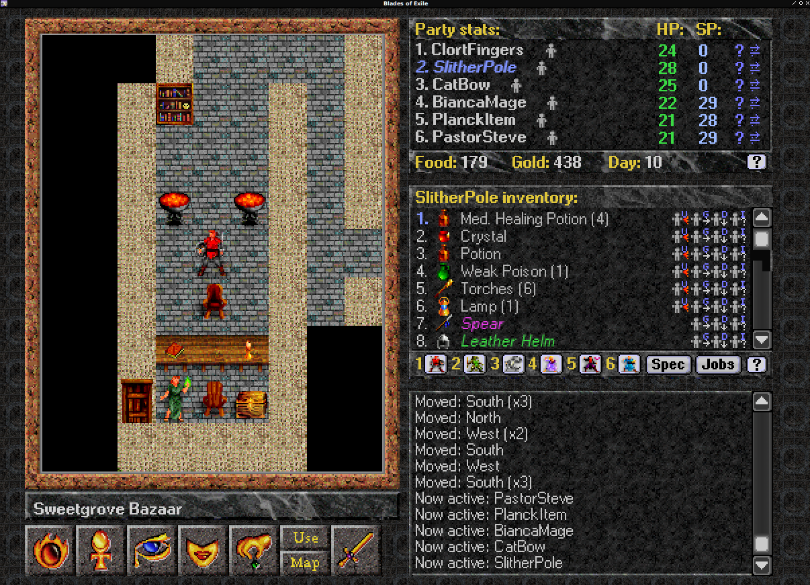

Dark Blades of Exile
=======================

This project hosts Clort's remastered graphics version of Open Blades of Exile 
https://github.com/calref/cboe

All colors have been changed. All fonts have been changed, and most graphics 
assets have been changed to 'No More Tears' versions.

The work is in progress and is being hosted on GitHub to help prevent data loss.

It should build cleanly on linux, possibly windows and mac as well.

Changes to functional code are minor, just performance and graphics enhancements.  Not all upstream commits are applied.  If someday this work can be merged into the main oBoE/cBoE tree, that would be great. 

